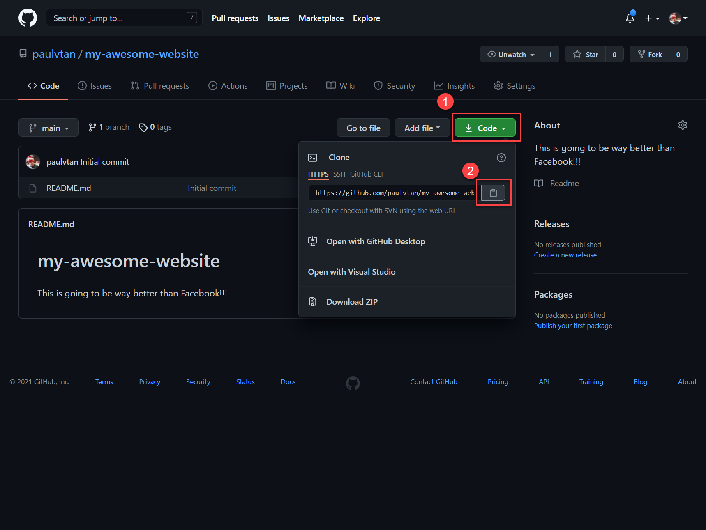

# Introduction to Git

## Introduction

So, you've written some codes, make a few changes, perhaps you already thoughts of 100 new features to add to your website. 

However, what if you make a grave mistake you don't have a history of your changes? What if you need to work with other people? Do you rely on your memory to try and undo your changes? Do we just email our code to our friend so they can also work on it? We need a better solution... 🤨

**Git** is an open-source _"version control system"_. A powerful content-tracker that allows us to document code, track changes and easily collaborate with other developers. 

**Git** has enabled people across the world to work together and brought countless innovative project to life. Simply put, **git** is an abosolute essential skills for any developers.

In this hands-on tutorial, you'll be learning how to use **git** to track your code changes as you continue building out your web application. 

We'll also be using _GitHub_, Microsoft **git** repositories hosting service to store our projects and start building out your portfolio! 🔥

## Learning Outcomes
By the end, you will be comfortable with the following:
- Basic understanding of Git and GitHub.
- What git repository, commits, branches and pull request are.
- Managing code changes using basic git commands.

## Requirements / Prerequisites
Make sure you have the following tools installed.
- [ ] Install [Visual Studio Code](https://code.visualstudio.com/) - Code editor.
- [ ] Install [Git](https://git-scm.com/) - Version Control system software.
- [ ] Register for a [GitHub Account](https://github.com/) - For hosting & storing our project.

## Contents
1. [Subtopics...](#exampleLink)

# 1. Creating git repository

Now that you have git installed, you can try run `git help git` command in your command prompt or terminal to see what the official manual of git has to say about itself. 🙂

1.1 Head over to GitHub and create a new git repository.

1.2 Fill out the basic repository details for your project. You can select 'Add a README file', this will initialzie your repository with a markdown file used to document and describe your project.

1.2 This is your git repository (think of it as your project folder and every changes in this folder will be tracked by git). 

Right now as you can see the only file in your repository is a README.md, which is displayed by default when you visit any repositories on GitHub.

# Making our first commit

1.3 Let's map 

