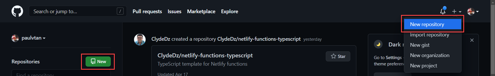
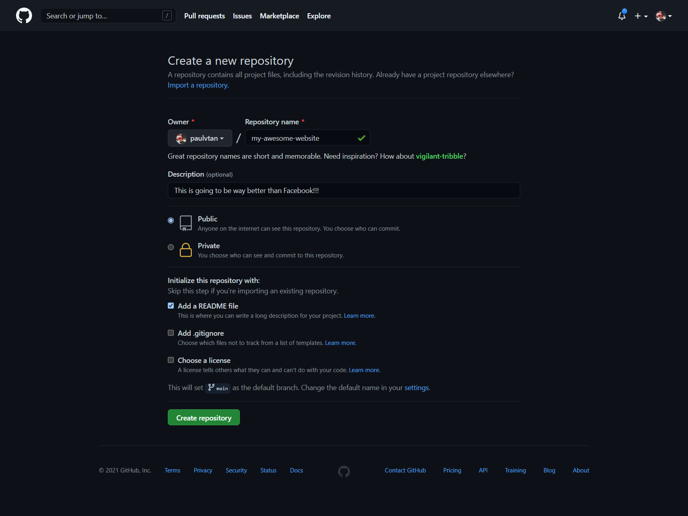
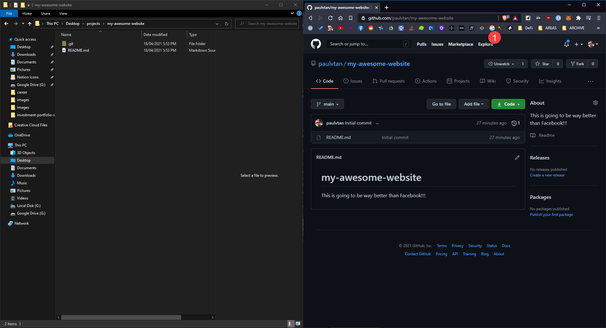
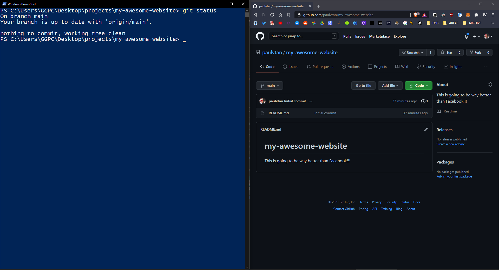

# Introduction to Git

## Introduction

So, you've written some codes, make a few changes, perhaps you already thoughts of the next 100 features to add to your website. 

But, what if you make a grave mistake and you don't have a history of your changes? What if you need to work with other people? Do you rely on your memory to try and undo your changes? Do you just email your code to our friend so they can also work on it? We need a better solution... 🤨

**Git** is an open-source _"version control system"_. A powerful content-tracker that allows us to document code, track changes and easily collaborate with other developers. **Git** has enabled people across the world to work together and brought countless innovative projects to life. Simply put, **git** is an absolute essential skills for any developers.

In this hands-on tutorial, you'll be learning how to use **git** to track your code changes as you continue building out your web application. 

We'll also be using _GitHub_, a Microsoft **git** repositories hosting service to store our projects and start building out your portfolio! 🔥

## Learning Outcomes
By the end, you will be comfortable with the following:
- Basic understanding of Git and GitHub.
- What git repository, commits, branches and pull request are.
- Managing code changes using basic git commands.

## Requirements / Prerequisites
Make sure you have the following tools installed.
- [ ] Install [Visual Studio Code](https://code.visualstudio.com/) - Code editor.
- [ ] Install [Git](https://git-scm.com/) - Version Control system software.
- [ ] Register for a [GitHub Account](https://github.com/) - For hosting & storing our project.

## Contents
1. [Creating git repository](#git-repo)
2. [Cloning our remote repository](#git-clone)
3. [Making our first commit](#git-commit)
4. [Using a branch](#git-branch)
5. [Branch merging & Pull Request](#git-merge)
6. [Closing](#git-close)

### __1. Creating git repository <a name="git-repo"></a>__

Now that you have git installed, you can try run `git help git` command in your command prompt or terminal to see what the official manual of git has to say about itself. 🙂

1.1 Head over to GitHub and create a new git repository.



1.2 Fill out the basic repository details for your project. You can select **Add a README file**, this will initialize your repository with a markdown file used to describe your project.



1.3 This is your git repository (think of it as your project folder where every changes in this folder will be tracked by git). 

Right now as you can see the only file in your repository is a README.md, which is displayed by default when you visit any repositories on GitHub.

### __2. Cloning our remote repository <a name="git-clone"></a>__

It wouldn't be ideal to start coding on the browser so let's clone this remote git repository to our local disk first.


2.1 Copy the url of the repository.


2.2 Navigate to a folder on your computer where you'd like to store your project. `Shift` + `right click` and open a powershell or command prompt inside the folder. 

2.3 Run `git clone` followed by your copied repository url. e.g. `git clone https://github.com/paulvtan/my-awesome-website.git `

```
git clone [repository-url] 
```

This will download our git repository into the current folder.


As you can see our 'local' git repository looks just like the remote git repository stored on GitHub. Any changes made to this local repository will be tracked as new changes!



*_the hidden .git folder is that specify this directory as a git repository._

### __3. Making our first commit <a name="git-commit"></a>__

Making a commit is like taking a snapshot of our current repository, recording changes permanently to the repository history. This allows us to progressively track changes as we develop our website, making it easy to collaborate with others. 

Git preserves a history of all commits allowing us to track what was changed and who made the change. We can even revert back to any specific commit in the history! ⌛

Let's record our first commit to the history.

3.1 Always start with `git status` to understand the current state of your repository.

In your local repository run.

```
git status
```
Here you can see git informing us that our remote and local repository is up-to-date with each other as we haven't made any changes to the repo.



3.2 Let's move our project files from previous section into our local repository. Run `git status` command again.


Here you can see that git has detected these as untracked new files (in red) as they have not been part of the commit history.

Similarly, source control tab in VS code show us these files are untracked (U). As you can see here, VS code supports and allows us to manage git from the graphical user interace. 

But for the purpose of practicing and understanding, we'll continue to use git command to manage our changes.


3.3 Run the following command to add all changes to the staging area. This prepares current changes to be included in the next commit!


```
git add .
```

or 

```
git add --all
```

💡 *You can use `git clean -f` to remove untracked files. (Delete any newly added files)*

💡 *Use `git checkout .` to remove any changes done to tracked files. (Removes changes done to repo's existing files)* 

3.4 Run `git status` again, now you'll see in both VS Code and command prompt (or powershell) that these changes have now been staged to include in the next commit! 

💡 *You can use `git reset` to unstage your changes.*


3.5 Make the commit using the following command.

```
git commit -m "Added project files"
```


A commit captures a snapshot of your current repository. This commit saves your staged changes to the local repository history tree. 

You must provide a short meaningful commit message using `-m` parameter. 

Describe what this commit captures so other developers can quickly understand what the new changes are. E.g. `"Added a new sign-in button"` or `"Fixed a typo in the Welcome page"`

3.6 Run `git log` to review a commit history of your local repository.

```
git log
```
💡 *Press `q` to exit from `git log`*


However, examining the commit history on GitHub repo you will see only the `Initial commit`. 


This is because a new commit is only on your local repository, it hasn't been synced to the remote repository on your GitHub. 

3.7 Run `git status` again, git knows that our local repository `main` branch is 1 commit ahead of our remote `origin/main` branch.


3.8 Run `git push` to push commits from our local repo to a remote repo. This exports commits to remote branches on our GitHub account.

```
git push
```
3.9 If you compare `git log` again, you'll now see that our repository both remote and local are now in sync with each other.

You can examine each commit to see what changes are included. 


💡 *Always a good idea to run `git fetch` to download any new commits from the remote repository in-case there've been changes made by other developers.*

💡 *Or use `git pull` to fetch and merge the remote branch into the current branch.*

Familiarize yourself with `git status`, `git add .`, `git commit -m "message"` and `git push` as these are basic git commands for adding new changes.

Continue making a few more changes and commiting them to the remote repo.

### __4. Using a branch <a name="git-branch"></a>__

Turns out it's a bad idea to make commits directly on `main` branch (gasp! 😱) as it should contains only the stable tested code ready for production. 

This is where a 'branch' comes in. A branch represents an independent copy of your repository. It allows you to develop and test your code independently without impacting your `main` branch.

Think of creating a branch as creating a parallel universe co-existing within the same repo starting from a specific commit. You can freely switch between branches anytime inside a repository.


You can develop new features, test it thoroughly and when you're ready, merge it back to `main`. Git will compare the differences in commit history between `main` and `feature` branches, then add those differences to `main` correctly. This allow multiple developers, teams to work together on different features on the same projects. 

Let's work on a new feature, any changes you'd like, in this example we'll add our website a logo.

4.1 In your local repository create and checkout a new branch using the following command.

```
git checkout -b "feature/new-logo"
```


This creates a new branch from the current commit. 

💡 Use `git branch` command to see available local branches and `git branch -r` to see the remote branches.

4.2 Run `git status` and `git log` we'll see that we're now on branch `feature/new-logo`, and that it's the same copy as our main branch with two commits we made earlier. 


We can also see in the visual studio bottom left corner that our branch has been switched to `feature/new-logo`.


4.3 Add a new logo to our app.

Add a new icon of desire and in index.html add.

```html

```


4.4 Once you're happy with the changes, use `git status`, `git add` and `git commit -m "Added a new logo"` make commit as needed, and push your changes to the remote repository. 

Since, it's a new branch that is not yet available on the remote repository. Git may show you a command to execute to push this local branch to the remote. 


```
git push --set-upstream origin feature/new-logo
```


Inspecting GitHub you'll notice that there are now two branches, `main` and `feature/new-logo`. Comparing it side by side you can see that both are mostly the same except our `feature/new-logo` is one commit ahead of `main` with the new logo added.


Inspecting commit history of both branch we can see our feature branch has one extra commit `Added a new logo` we pushed from our local repo.


Keep developing and adding new commits on your `feature/` until your feature development is complete.

### __5. Branch merging & Pull Request <a name="git-merge"></a>__

Now comes the time when you're ready to merge your `feature/branch` to the `main` branch after you've done your development and testing. Merging simply creates a new merge commit and bring over all the changes you made on feature branch.


While you can simply run `git checkout main` on your local repo to switch to main branch and merge the two branches by doing 
`git merge feature/new-logo` (This merged `feature/new-logo` into the currently checkouted `main` branch), followed by a `git push` to the remote `main` branch.

It's much better to utilizes a **pull request**. Filing a pull request is simply requesting your team to review the code changes, a feature you've implemented. 

Your team can review, give suggestions and approve your pull request, which allow you to merge your `feature/` branch into `main`.

5.1 Let's initiate our pull request from GitHub. Head to your `feature/new-logo` on GitHub, hit Pull request button to create a new pull request.


5.2 Here you can fill out the details about your changes and add reviewers. Hit `Create pull request`. 

Your team members can come and inspect all commits involved with this pull request and make decision accordingly. 


5.3 When the pull request have been reviewed and approved. Confirm `merge pull request`, 


It's always a good practice to delete your `feature/branch` once it's been merged into `main`.


💡 Delete local branch using `git branch -d 'feature/new-logo'`

Now, your `main` branch will have commits that were on `feature/` branch.


### __Closing <a name="git-close"></a>__

Now you've learnt all you need to know to get started with Git and GitHub. 🔥 Keep practicing, develop your next features on a new `feature/` branch, start collaborating with other people. Practice using pull request to merge your code.

Best of luck with the rest of the program! 


