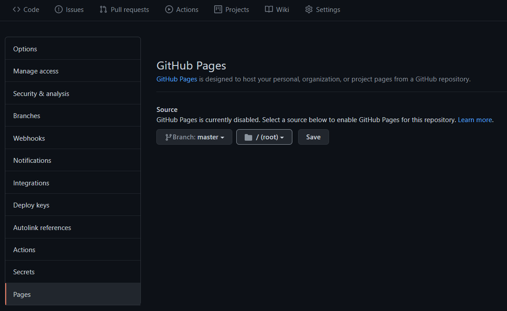

# Intro to HTML, CSS, and Javascript

## Introduction

This workshop is designed for people with little or no HTML, CSS, and JavaScript experience. These languages and concepts will help you pick up ReactTS and web development :computer: which is required in every phase.

We will be going through the basics of HTML, CSS, and JavaScript to develop a simple webpage.

As always, please do not hesitate to reach out if you are stuck or do not understand the content. :smile:

## Learning Outcomes

By the end, you will be comfortable with the following:

- What are HTML, CSS, and JavaScript?
- How to create a basic webpage using HTML
- How to style HTML elements using CSS
- How to use media queries in CSS
- How to use dev tools
- How to make HTML interactive using HTML

## Requirements / Prerequisites

- A Browser :globe_with_meridians:

  - Chrome, Firefox, or Microsoft Edge (IE doesn't count :upside_down_face:)

- Text Editor :memo:
  - Recommending [Visual Studio Code](https://code.visualstudio.com/)

## Contents

[Introduction to HTML](#html-intro)

1. [What is HTML](#html-what)
2. [Let's create a HTML file](#html-add)
3. [Basic Syntac for HTML](#html-syntax)
   - 3.1 [Tags](#html-tag)
   - 3.2 [Attributes](#html-attribute)
4. [Add comments](#html-comment)
5. [DevTools - Inspect](#html-inspect)

[Introduction to CSS](#css-intro)

1. [What is CSS](#css-what)
2. [Let's add some CSS](#css-add)
3. [Basic Syntac for CSS](#css-syntax)
   - 3.1 [Selectors](#css-selector)
   - 3.2 [Let's add some more styling](#css-style)
   - 3.3 [Let's add the styles to the actual HTML](#css-style-html)
4. [Priority and Overriding](#css-priority)
   - 4.1[Specificity](#css-specificity)
   - 4.2[Chaining Mutiple Classes](#css-chain)
5. [Properties](#css-props)
   - 5.1[Property Explaination](#css-explain)
6. [Media Queries](#css-media)

[Introduction to JavaScript](#js-intro)

1. [What is JavaScript](#js-what)
2. [Devtools - Console](#js-console)
3. [Using loading a .JS file](#js-loading)
4. [Learn JavaScript](#js-learn)
   - 4.1 [Variables](js-variable)
   - 4.2 [Functions](js-function)
5. [Retrieving Elements from HTML](#js-element)
   - 5.1 [Interacting with Elements](js-handler)
   - 5.2 [Adding Listeners](js-handler)
   - 5.3 [Changing CSS Classname](js-classname)
6. [What's Next? :tada:](js-next)

[Hosting your site (optional)](#hosting)

## **Introduction to HTML <a name="html-intro"></a>**

---

HTML is a very evolving markup language and has evolved with various versions updating. The version we are using now is HTML 5 which was published in the year 2012 :black_nib:.

### **1. What is HTML <a name="html-what"></a>**

HTML is the standard markup language for creating Web pages. A HTML file describes the structure of a Web page and consists of a series of elements.

HTML elements tell the browser how to display the content.
An HTML element is defined by a start tag, some content, and an end tag:

```html
<tagname>This is content</tagname>
```

There are also empty elements, e.g. `<br>`, ``, `<meta>`, `<hr>`, etc.

### **2. Let's create a HTML file <a name="html-add"></a>**

First let's create our HTML file.

1. File -> New File -> Name As index.html
2. Copy the following template code and paste it into the file.

```html
<!DOCTYPE html>
<html lang="en">
  <head>
    <meta charset="UTF-8" />
    <title>Document</title>
  </head>
  <body></body>
</html>
```

3. Save the file.

### **3. Basic Syntac for HTML <a name="html-syntax"></a>**

Before we have a dive into the tags section, here is something you should know about:

> HTML elements can be nested (elements can contain elements). A nested element, also called a child element, can be a parent element too if other elements are nested within it. HTML tags should be nested in correct order. They must be closed in the inverse order of how they are defined, which means the last tag opened must be closed first. This promotes inheritence where the parent element can give its properties (some) to its children so they don't have to be assigned those properties directly.

#### **3.1 Tags <a name="html-tag"></a>**

In the template code, `<!DOCTYPE html>` is for declaring the doc type. The HTML document itself begins with `<html>` and ends with `</html>`.

##### `<head>` and `<meta>` tag

The `<head>` element is a container for metadata (data about data) and is placed between the `<html>` tag and the `<body>` tag. HTML metadata is data about the HTML document which will not be displayed.

The meta tag indicates metadata information that won't typically be visible to the viewer unless they view source code in their browser. Meta elements or tags provide descriptive information about the webpage. It is to be noted that the HTML `<meta>` tag comes within the `<head>` tag. Moreover, meta tags get passed in the form of a name-value pair.
Example:

```html
<meta
  name="description"
  content="HTML Meta Tag - Meta can be called as data about data."
/>
```

This is used to describe the web page.

##### `<body>` tag

The content between `<body>` and `</body>` tags is the visible part of the HTML document.

Besides, here are some other tags we have to know about:
`<h1>` to `<h6>` defines the titles or subtitles of the webpage content.
`<p>` defines a paragraph.
`<a>` defines a hyperlink
`<strong>` defines text with strong importance. The content inside is typically displayed in bold.
`<div>` is used as a container for other HTML elements. The `<div>` element is a block-level element.
`<table>`, `<tr>`, `<td>`, `<th>`
The `<table>` tag defines an HTML table. Each table row is defined with a `<tr>` tag. Each table header is defined with a `<th>` tag. Each table data/cell is defined with a `<td>` tag.
`<br>` defines a line break, and is an empty element without a closing tag.
`<title>` defines the title of the document.

> Practice: write your HTML document with the mentioned tags. Open the file using any browser. (Google Chrome is recommended)

#### **3.2 Attributes <a name="html-attribute"></a>**

- All HTML elements can have attributes
- Attributes provide additional information about elements
- Attributes are always specified in the start tag
- Attributes usually come in name/value pairs like: name="value"

Example:

```html
<a href="https://nzmsa.netlify.app/">MSA Website</a>
```

`href` is an attribute of the element.

More attributes will be introduced in the following workshop.

### **4. Add comments<a name="html-comment"></a>**

HTML comments are not displayed in the browser, but they can help document your HTML source code.

You can add comments to your HTML source by using the following syntax:

```HTML
<!-- This is how you add comments -->
```

### **5. DevTools - Inspect<a name="html-inspect"></a>**

1. **press F12** or **CTRL + SHIFT + I** or **Right-Click Inspect** in the broswer.
2. You can see the source code on inspect mode. If not, click **Elements** tab to see the code.
   

Now you can manipulate the source code. For example, add an extra `<p>` element with some content. Then check out the changes to the webpage. Remember this change in the source code will not change the original file. Once you refresh the page, it will be gone.

## **Introduction to CSS <a name="css-intro"></a>**

---

> We'll be introducing some basic CSS to get you up to spend with how we change our website's look.

### **1. What is CSS <a name="css-what"></a>**

CSS stands for **Cascading Style Sheet**, and it is used for styling our HTML. Without it, our site is pretty much as basic as it can get.

Think of it link when you style your Word documents with different Fonts, Font Sizes, Colors, Image, etc.
Many things I'll be going through are similar to what we would do in Word.

### **2. Let's add some CSS <a name="css-add"></a>**

First, let's add our CSS file.

1. File -> New File -> Save As styles.css
2. We need to link our CSS file with our HTML or else the HTML won't know where its styling is.
3. In our index.html let's add the following line inside our `<head></head>`

```html
<link rel="stylesheet" href="style.css" />
```

The link element has `rel` (relationship) property which allows us to link our CSS as a stylesheet. There are many other values for `rel` for different applications, but we'll stick with "Stylesheet" for now.

`href` is the location of our file; in our case, it's in the same folder, so we only need to specify the filename. If you had it in another folder, you might need to give the full path. The path could also be a URL to a website where the CSS is hosted.

### **3. Basic Syntac for CSS <a name="css-syntax"></a>**

We've linked our CSS together with our HTML but we don't have anything in it currently. Before we add anything CSS has to formatted/writen in the format below.


> **Selector** - Allows us to select a particular element to style

> **Property** - The particular styling we want to apply

> **Property Value** - The value of the style.

The example in the image is we want **all** `<p></p>` to be the color red.

So let's add that CSS to our file.

```css
p {
  color: red;
}
```

#### **3.1 Selectors <a name="css-selector"></a>**

We have just used one type of **Selector**, but the ones I'll be going through in this section are

- `*` Global selector
  - Applies styling to all elements in our HTML
- `.class` Class selector
  - Applies to any element whose class is equal to it.
  - Syntax starts with a `.` to distinguish it as a class
- `#id` Id selector
  - Applies to any element whose Id is equal to it.
  - Syntax starts with a `#` to distinguish it as an Id
- HTML Element selector
  - Applies to any HTML elements i.e. `<h1>,<p>,<div>,<table>, etc.`

#### **3.2 Let's add some more styling <a name="css-style"></a>**

1. Let's add some styling through our `global selector`

```css
* {
  font-family: "Times New Roman", Times, serif;
  font-size: 24px;
}
```

2. Let's add some styling using the `element selector` to our `<h1></h1>` and body `<body></body>`

```css
h1 {
  font-size: 32px;
  color: white;
  text-align: center;
}
body {
  background-color: lightblue;
}
```

3. Let's add some styling using the `class selector`

```css
.class-example-1 {
  color: blue;
}
```

4. Let's add some styling using the `id selector`

```css
#id-example-1 {
  color: green;
}
```

Now that we've added some CSS, we need to select what we want to style in our HTML, and this applies to the `id selector` and `class selector` as the `element selector` already specifies what it wants to style.

#### **3.3 Let's add the styles to the actual HTML <a name="css-style-html"></a>**

1. Let's add the class `class-example-1` to our first paragraph

```html
<p class="class-example-1">My <strong>first</strong> paragraph.</p>
```

2. Let's add the id `id-example-1` to our second paragraph

```html
<p id="id-example-1">My <strong>second</strong> paragraph.</p>
```

3. Let's refresh our site.
   

You will see that the 2 paragraphs have to be styled with the colour we specified in our CSS, but you will also notice that our header `<h1>` did not change colour.

### **4. Priority and Overriding <a name="css-priority"></a>**

In CSS there a hierarchical order to which styling get priority over each other.

`Inline > Id > Class > Element > Global`

This is why our `<h1>` did not change colour because our inline styling is prioritising and overriding the colour property.

```html
<h1 style="color: red">Hello World</h1>
```

Our `font-size` and `text-align` properties will still get applied because there is no overriding of those properties in the inline CSS.

We can also see priority if we add the id `id-example-1` to our first paragraph and class.

```html
<p id="id-example-1" class="class-example-1">
  My <strong>first</strong> paragraph.
</p>
```

Again if any properties overlap, then the styling from the highest priority selector gets applied. Styling from the lower will still get applied if there is none in the higher priority selector.

#### **4.1 Specificity <a name="css-specificity"></a>**

You can actually combine the selector together if you want to have a very specific element styling

```css
p#id-example-1.class-example-1 {
  color: yellow;
}
```

In the example above, if we add it to our CSS and refresh our page can see the text turning yellow. This is because CSS has a rule where the more specific you select an element, the higher its priority.

#### **4.2 Chaining Mutiple Classes <a name="css-chain"></a>**

You can actually use more than one class in an element. Useful for if you have some alternative styling to the regular styling i.e. dark mode button colors or different colour for cancel and ok buttons.

```css
p#id-example-1.class-example-1 {
  color: yellow;
}
```

```css
.class-example-2 {
  text-align: center;
}
```

```html
<p id="id-example-1" class="class-example-1 class-example-2">
  My <strong>first</strong> paragraph.
</p>
```

### **5. Properties <a name="css-props"></a>**

We're already halfway through the CSS section, and I'm only now going to explain properties and property values. Unfortunately, there are way too many properties for my brain to know and understand, but I'll go through some of the core properties you'll probably encounter.

- Font-Family
- Font-size
- color
- background-color
- text-align
- border
- width
- height
- padding
- margin
- Float

More can be found here: https://developer.mozilla.org/en-US/docs/Web/CSS/Reference

Let's add some table styling.

```css
table,
td {
  border: solid 1px black;
  text-align: center;
}
```

> you can use the comma as a separator if you have the same styling on the same selectors

Let's add some properties to our last div

```css
.div-class {
  background-color: white;
  height: 400px;
  width: 400px;
  padding: 15px;
  border: dashed 10px black;
  margin: 20px;
}
```

#### **5.1 Property Explaination <a name="css-explain"></a>**

If you go into your browser and go into the dev console, we can see the element styling. Google Chrome will helpfully show you have the content is spaced if you inspect the element. You even change things on the fly :open_mouth:.

> You could also do this to all website and check out what colour they have used or how they did their styling.


- Height: Total height of your content
- Width: Total width of your content
- Padding: Adds space between your border and your content i.e. the start of the text.
- Border: Adds on top of that padding.
- Margin: Adds space between your element and the next element.

Let's copy and paste our div again.

```html
<div class="div-class">hello world 1</div>
<div class="div-class">hello world 2</div>
```

As you can see, the 2 divs are separated by a margin between them.

Let's say we want our divs to be side by side. we can add the property: `float: left;` to our `div-class;`

This is useful if you wanted an image and text to be side by side.

### **6. Media Queries <a name="css-media"></a>**

Media Queries allows us to change the look of our site depending on the screen size. Wether that be support for lower resolution desktop or for mobile devices :iphone:.

```css
@media only screen and (max-width: 800px) {
  body {
    background-color: forestgreen;
  }
}
```

## **Introduction to JavaScript <a name="js-intro"></a>**

---

> Let's introduce some interactivity to our webpage using JavaScript!

This session won't make you instantly fluent in JavaScript but will get you started on the journey of JavaScript with its core ideas and methodology.

### **1. What is JavaScript <a name="js-what"></a>**

JavaScript is a high-level programming and scripting language that allows you to implement complex features on web pages and make web pages interactive :smile:.

### **2. Devtools - Console <a name="js-console"></a>**

We are going to add our first line of JavaScript to our code by adding to the header section of the HTML.

```js
<script>console.log("Hello World");</script>
```

We can also display output to the console.
After typing this, click on the "console" button on the bottom-left part of the screen to see the output.


You can also **press F12** or **CTRL + SHIFT + I** or **Right-Click Inspect**, and then click on the "Console" tab to open the console.

### **3. Using loading a .JS file <a name="js-loading"></a>**

We are going to create an `index.js` file within our root directory.

- File -> New File -> Name As index.js

This is where we are going to store all our JS code. Just like CSS separating it from the HTML file improves readability.

To load this file we are going to change our `<script>...</script>` into

```js
<script src="index.js"></script>
```

Notice that when we move `console.log("Hello World");` into `index.js` the same response is shown in the console.

### **4. Learn JavaScript <a name="js-learn"></a>**

Let's learn some basic JavaScript and its properties.

#### **4.1 Variables <a name="js-variable"></a>**

A variable in JavaScript can be anything.

```js
// Let's define a variable
let myVariable = "anything"; // a string
console.log(myVariable);

myVariable = 12; // a number
console.log(myVariable);

myVariable = true; // a boolean
console.log(myVariable);

let empty; // undefined
console.log(empty);
```

If you haven't noticed, I am placing semicolons after each line. But they are optional and are more to do with styling.

#### **4.2 Functions <a name="js-function"></a>**

Let's define a function

```js
function myFunction() {
  console.log("myFunction");
}

myFunction(); // Call my function multiple times
myFunction();
```

A function is a variable

```js
console.log(myFunction);
```

We can also define functions using arrow functions

```js
const myArrowFunction = () => {
  console.log("myArrowFunction");
};
```

### **5. Retrieving Elements from HTML <a name="js-element"></a>**

To create interactivity in JS, we must first get the correct elements we want the user to interact with, e.g. a button.

Add this to your `index.js` file

```js
const btn = document.getElementById("btn");
console.log(btn);
```

These two lines gets the Element with the id of `btn` which is defined on the button by the attribute `id="btn"`

```html
<button id="btn">Click me</button>
```

However, when we check the console, we will find `null`. So what does this mean? This means the element we retrieved is `null`, aka empty. This is not what we want as we wanted to log out of the button.

So HTML and JS is an interpreted language which means that the browser interprets your code line by line from top to bottom. In this case, we are loading the element with `id="btn"` before the button is defined, which results in `null`.

To fix this we can move our `<script src="index.js"></script>` after the definition of the button. It should print out the element for the button:

```html
<button id="btn">Click me</button>
```

This fix is hacky, we can do better by keeping the script in the HTML header and just wrap our JS code using:

```js
window.onload = () => {
  const btn = document.getElementById("btn");
  console.log(btn);
};
```

#### **5.1 Interacting with Elements <a name="js-handler"></a>**

We can change the innerHTML of the button. We can change the button to red by applying changes using JS.

```js
const btn = document.getElementById("btn");
btn.innerHTML = "Red";
btn.style = "color: red";
```

#### **5.2 Adding Listeners <a name="js-listen"></a>**

To create interactivity in JS, we must first get the correct elements we want the user to interact with, e.g. a button.

```js
const handleClick = () => {
  console.log("I clicked my btn");
};

btn.onclick = handleClick;
```

This is practically the same as

```html
<button id="btn" onclick="handleClick">Red</button>
```

However, just like how we separated HTML and CSS, we want to separate HTML and JS. It is bad practice to have HTML and JS in the same file.

#### **5.3 Adding State <a name="js-listen"></a>**

We change to create a true or false state for the button using a bool and to change the button based on the state.

Here we define a boolean variable called `blue` and using an `if` statement to check the condition.

```js
let blue = false;

const handleClick = () => {
  console.log("I clicked my btn");
  if (blue) {
    // If currently blue change to red
    btn.innerHTML = "Red";
    btn.style = "color: red";
  } else {
    // If currently not blue change to blue
    btn.innerHTML = "Blue";
    btn.style = "color: blue";
  }
  console.log("my current colour is blue:", blue);
  blue = !blue;
  console.log("my new colour is blue:", blue);
};
```

#### **5.4 Changing CSS Classname <a name="js-classname"></a>**

Let's try to integrate HTML, CSS and JavaScript.

To do this, we want to change an HTML element's list of *classnames*. To do this, we are going to get some help from the [**documentation here**](https://developer.mozilla.org/en-US/docs/Web/API/Element/classList)

```js
const example = document.getElementById("id-example-1");

// We can remove classnames using
example.classList.remove("class-example-1");

// We can also add classnames using
example.classList.add("new-background");
```

As a developer, we want to use classList instead of styling using `*.style` as this increases the logic required in our JavaScript code. We can simplify our code using predefined classnames.

### **6 What's Next? :tada: <a name="js-next"></a>**

You just learnt basic HTML, CSS and JavaScript, so what's next?

Try changing the `handleClick()` to use `classList.add` and `classList.remove` and make your webpage more interactive. We love to see your work share it with us on our [**Discord Server**](https://discord.gg/CaRGfbpEcR)

Showcase what you have learnt using GitHub and host your website with the [guide](#hosting) below.

Want more? Checkout Microsoft Learn's [**Build a simple website using HTML, CSS, and JavaScript**](https://docs.microsoft.com/en-us/learn/modules/build-simple-website/)

## **Hosting your website (optional) <a name="hosting"></a>**

---

Host your static webpage for free on GitHub pages.



Go to your Github Repo

- Go to Settings.
- Go to Pages.
- Select master branch and the folder your `index.html` is located
- Click Save.

Your website would be published to `http(s)://<username>.github.io/<repository>`
