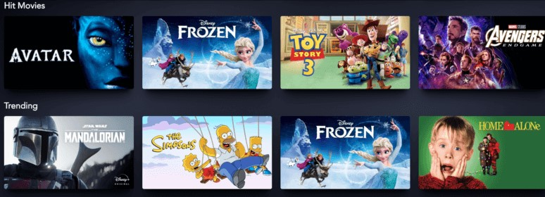

# TypeScript

## Introduction
TypeScript is an open-source language by Microsoft which builds upon the original syntax of JavaScript, often referred to as its subset. It provides unique features such as static type definitions, classes and interfaces which makes it easier for developers to resolve issues, as your application becomes larger.

## Learning Outcomes
- What is TypeScript?
- Benefits during development
    - Advantages over vanilla JavaScript
- Installing TypeScript through NodeJS
- Features provided by TypeScript
    - Datatypes
    - Classes
    - Interfaces
- Migration Strategies

## Requirements / Prerequisites
- [NodeJS (for npm)](https://nodejs.org/en/download/)
- [Visual Studio Code](https://code.visualstudio.com/)

## Contents
1. [What is TypeScript?](#what-is-typescript)
2. [JavaScript (and it's problems)](#javascript-(and-its-problems))
3. [Setting Up TypeScript Environment](#setting-up-typescript-environment)c
4. [Datatypes](#datatypes)
5. [Interfaces](#interfaces)
6. [Classes](#classes)

## What is TypeScript?
TypeScript is an open-source language which builds on JavaScript, developed by Microsoft. It provides many features commonly seen in Object-Oriented languages such as static type definitions, and compiler errors which makes it easier for the developer to resolve problems.

Since TypeScript is a super-set of JavaScript, it is valid for vanilla JavaScript code to be written inside a `.ts` file, but the same is not possible for vice-versa.


## JavaScript (and it's problems)
JavaScript powers most of the websites on the internet these days, providing exciting features like adding event listeners and dynamically manipulating the Document Object Model (DOM) elements through code. This increases the overall interactivity of the application.

However, as the language has evolved through the years, there have been some additions to the language which could lead to issues in larger codebases.

### Example One
In the example below, the `1 < myNumber` predicate inside the if-statement is executed first, which evalutes to `true`. 

Note that in JavaScript, `true` is also represented as `1`. Next up, the predicate `1 < 10` is executed and evaluted to `true`, which means the if-statement is `true` overall.

```javascript
let myNumber = 15;
if (1 < myNumber < 10) {

    // This block is executed.
    console.log("Boolean was true!");
}
```

### Example Two
When performing simple arithmetic between a string and a number, JavaScript behaves very differently. 

During addition, the integer `1` is converted to a string, and then concatenated to the end of `"3"`. While performing subtraction, the string `"3"` is converted to an integer, and then the calculation is performed normally. 

```javascript
console.log("3" - 1); // Evaluates to 2.
console.log("3" + 1); // Evaluates to '31'.
```

### Example Three
`NaN` in JavaScript represents an output which is "Not A Number". This makes sense for the first execution where we try to multiply an integer with a string.

However later, when we try to find the datatype of `NaN`, JavaScript tells us that it is an integer, but which is very confusing.

```javascript
console.log("Shrey" * 17); // Evaluates to NaN.
console.log(typeof NaN); // Evaluates to integer.
```

## Setting Up TypeScript Environment
1. **Install the TypeScript package globally**
    - The –g flag is indicating that you are installing the Node package globally, and it’s not associated to any specific project.
    - This package will help compile your TypeScript code into JavaScript.
    - Note that you can install TypeScript on a project-level, but here it’s done globally.

    ```javascript
    npm install -g typescript
    ```

2. **Initialize a Node project**
    - Create an empty folder and initialize it as an empty Node project.
    - Step through the creation wizard by entering the information required.

    ```javascript
    npm init
    ```

3. **Compiling Process**
    - To convert your TypeScript code into JavaScript, run the following command.

    ```javascript
    /* Compile all .ts files in the directory */
    tsc *.ts

    /* Compile particular .ts file */
    tsc myFile.ts

    /* Compile particular .ts files */
    tsc myFile.ts anotherFile.ts
    ```

## Datatypes
There are three main datatypes which are going to be covered during this tutorial: Booleans, Numbers and Strings.

### Boolean

This is the most basic datatype in any programming language, not just TypeScript, and it can either be True or False. For example, you could use a boolean to describe the current weather like shown below.

```typescript
let isRaining: boolean = true;
let isSunny: boolean = false;
```

### Number

In other programming languages, numbers such as integers (whole numbers) and floating-point values (containing decimal places) are described differently. However in TypeScript, you can classify any numerical value as just a number.

Hence, there is no real distinction between whole numbers and floating-point values in TypeScript.

```typescript
let myAge: number = 17;
let pi: number = 3.14;
```

### String

Strings are pretty much a collection of characters, and they are an essential part of any software. In TypeScript, you can either define a string using single quote character (`'`) or double quotes (`"`).

```typescript
// First method to create strings.
let firstString: string = 'Hello';

// Second method to create strings.
let secondString: string = "World";

// Concatenating Strings.
console.log(`${firstString} ${secondString}`); // Returns "Hello World".
```

### Array

An array is not a separate datatype, but a construct of programming languages used to store a collection of values. A single array can only contain values of a single datatype e.g. string array, or integer array.

```typescript
// First method of creating arrays.
let myArray: Array<number> = [1, 17, 20];

// Second method of creating arrays.
let myArray: number[] = [1, 17, 20];
```

Arrays are really important in frameworks such as React, where you have to conditionally render a specified amount of components. Such an example can be seen below where you have an array of movies you want to show on your website, and then using React, you iterate through each movie and display a card for it.

<br/>

<p align="center">
    
</p>

<br/>

## Interfaces

Interfaces are essentially a powerful way of defining contracts within your codebase, so people know how to interact with your application. This is useful for defining the structure of arguments to your functions.

```typescript
// Defining our contract.
interface Person {
    name: string,
    age: number,
    gender: string
}

// Function that says Hello to the person.
function sayHello (person: Person) {
    console.log(`Hello, ${person.name}!`);
}
```

## Classes

Classes are an integral part of any Object-Oriented language, and they are ways to define a blueprint for creating objects. Classes are made up of the following internal components.

- **Fields -** variable or a piece of information belonging to objects of that class.

- **Constructors -** way to create objects of our class.

- **Methods -** actions that our class object can carry out on itself.

```typescript
class Person {
    // Fields: properties that define an instance of a Person.
    private name: string;
    private posX: number;
    private posY: number;

    // Constructor: way to create object of this class by providing the Person name.
    constructor (personName: string) {
        this.name = personName;
        this.posX = 0;
        this.posY = 0;
    }

    // Method 1 - making the Person instance move by changing its position.
    move (moveInX: number, moveInY: number) {
        this.posX = this.posX + moveInX;
        this.posY = this.posY + moveInY;
    }

    // Method 2 - printing out the Person's current location.
    getCurrentPosition () {
        console.log("The current position of " + this.name + " in X direction is: " + this.posX);
        console.log("The current position of" + this.name + " in Y direction is: " + this.posY);
    }
}
```

# Additional Resources
- [TypeScript's Official Documentation](https://www.typescriptlang.org/)
- [Mozilla Web Docs for JavaScript](https://developer.mozilla.org/en-US/docs/Web/JavaScript/Guide)